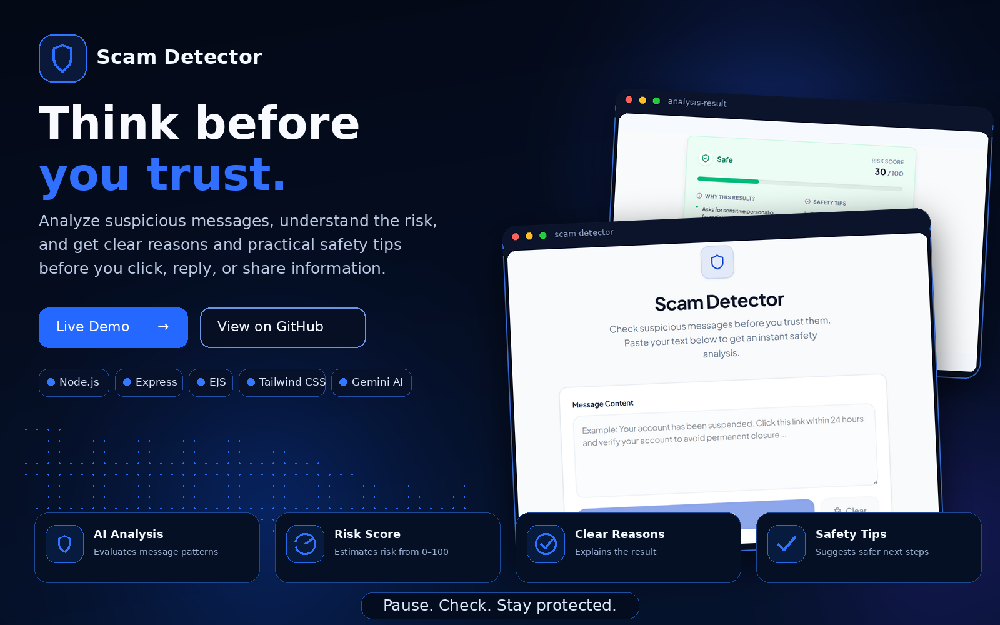
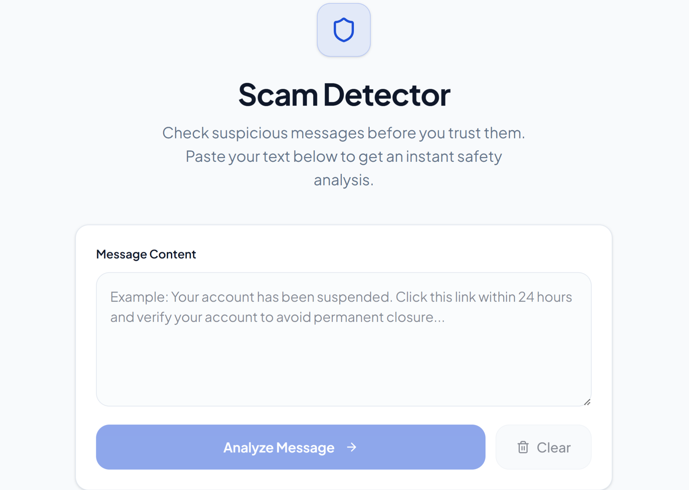
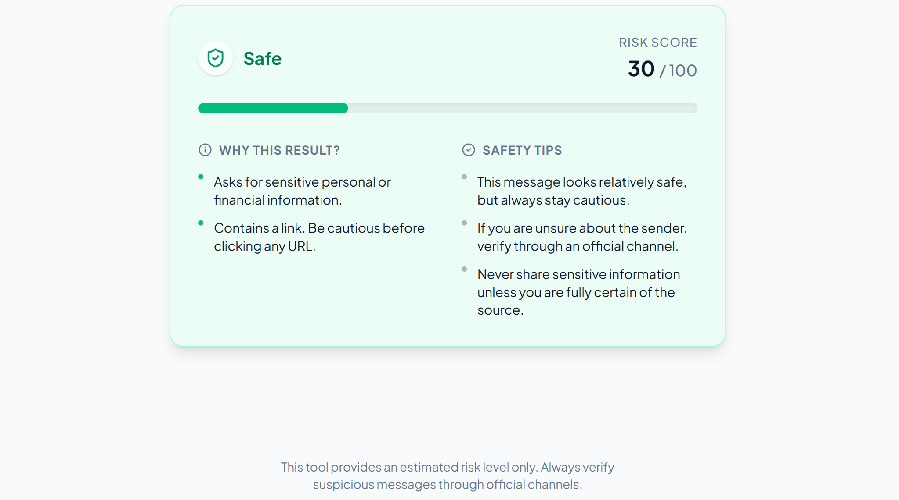

<div align="center">

<a href="https://replit.com/@judebingadeer/ScamDetector">
  
</a>

<br><br>

# Scam Detector

### AI-powered message safety analysis for smarter online decisions

Scam Detector analyzes suspicious messages and estimates their risk level before users click a link, reply to a sender, or share sensitive information. It provides a clear risk score, explains the warning signs it detected, and offers practical safety tips.

<br>

<a href="https://replit.com/@judebingadeer/ScamDetector">
  
</a>

<a href="https://github.com/judebingadeer/ScamDetector">
  
</a>

</div>

---

## The Idea Behind Scam Detector

Online scams often rely on urgency, fear, suspicious links, requests for personal information, and messages designed to pressure the recipient into acting quickly.

Scam Detector was created to make these warning signs easier to understand.

Instead of returning only a basic safe-or-unsafe label, the application analyzes the submitted message, estimates its risk level, explains the reasons behind the result, and gives the user practical steps to verify the message safely.

---

## What Scam Detector Does

- Analyzes pasted message text for possible scam and phishing indicators
- Classifies the result using a clear safety status
- Generates an estimated risk score from 0 to 100
- Identifies warning signs found in the message
- Explains why the result was generated
- Detects risky patterns such as suspicious links and sensitive-information requests
- Provides practical safety tips based on the analysis
- Presents the result through a clean and easy-to-read interface
- Allows users to clear the current message and run another check

---

## Live Experience

<div align="center">

<a href="https://replit.com/@judebingadeer/ScamDetector">
  
</a>

</div>

---

## Application Walkthrough

### 01 — Message Input and Analysis

The main page gives users a focused space to paste a suspicious message.

After entering the text, the user can select **Analyze Message** to begin the safety assessment. A separate **Clear** action removes the current message and resets the form.



---

### 02 — Risk Result and Safety Guidance

The result page presents the estimated message risk in a structured format.

Users can view:

- The overall safety classification
- A risk score out of 100
- A visual risk indicator
- The reasons behind the result
- Message-specific warning signs
- Practical safety recommendations



---

## Technology Stack

<div align="center">

<a href="https://nodejs.org/">
  
</a>

<a href="https://expressjs.com/">
  
</a>

<a href="https://ejs.co/">
  
</a>

<a href="https://tailwindcss.com/">
  
</a>

<a href="https://ai.google.dev/gemini-api">
  
</a>

<a href="https://replit.com/">
  
</a>

</div>

<br>

| Layer | Technology | Role |
|---|---|---|
| Runtime | Node.js | Runs the server-side application |
| Backend | Express.js | Handles routes, requests, and analysis flow |
| Templates | EJS | Renders the application pages and results |
| Styling | Tailwind CSS | Creates the responsive interface and visual design |
| Artificial Intelligence | Gemini API | Analyzes message content and generates structured safety guidance |
| Development & Deployment | Replit | Supports development and application hosting |

---

## How the System Works

```text
User pastes a suspicious message
              │
              ▼
The message is submitted to the
Node.js and Express backend
              │
              ▼
The backend prepares a structured
safety-analysis request
              │
              ▼
Gemini analyzes the message for
scam and phishing warning signs
              │
              ▼
The application receives a risk score,
classification, reasons, and safety tips
              │
              ▼
The result is displayed in a clear
and user-friendly safety report
```

---

## Analysis Output

Each completed assessment is designed to provide four main elements:

### Safety Classification

A clear status helps the user understand the estimated level of concern at a glance.

### Risk Score

The application displays an estimated score from **0 to 100** to represent the detected level of risk.

### Why This Result?

The analysis highlights suspicious patterns that influenced the result, such as:

- Requests for personal or financial information
- Links that should be verified before opening
- Urgent or threatening language
- Pressure to act immediately
- Unusual verification or payment requests

### Safety Tips

The application recommends safer actions, including verifying the sender through an official channel and avoiding the sharing of sensitive information.

---

## AI Transparency

Scam Detector uses the Gemini API to interpret the submitted message and return a structured safety assessment.

The generated result is an estimate based on the text provided. It should be treated as a decision-support tool rather than a guaranteed determination that a message is safe or fraudulent.

The application does not open links, contact senders, access external accounts, or independently verify the identity of the message source.

---

## Privacy and Responsible Use

- The application does not require a user account
- The current interface does not include saved message history
- Message text is submitted only for the requested analysis flow
- Users should avoid entering passwords, one-time verification codes, card details, or highly sensitive personal information
- Suspicious messages should always be verified through the organization's official website, application, phone number, or customer-support channel

---

## Important Notice

Scam Detector provides an **estimated risk level only**.

A low-risk result does not guarantee that a message is legitimate, and a high-risk result does not replace confirmation through official channels. Users should never rely on the score alone when a message requests money, login credentials, verification codes, banking information, or urgent action.

---

## Future Development

- URL reputation and domain inspection
- Support for Arabic and additional languages
- Screenshot and image-based message analysis
- Optional local analysis history
- Expanded scam-category detection
- Official reporting and verification resources
- Browser-extension support
- More detailed risk explanations

---

<div align="center">

## Pause. Check. Stay Protected.

<br>

<a href="https://replit.com/@judebingadeer/ScamDetector">
  
</a>

<br><br>

Built with Node.js, Express.js, EJS, Tailwind CSS, and the Gemini API.

</div>
